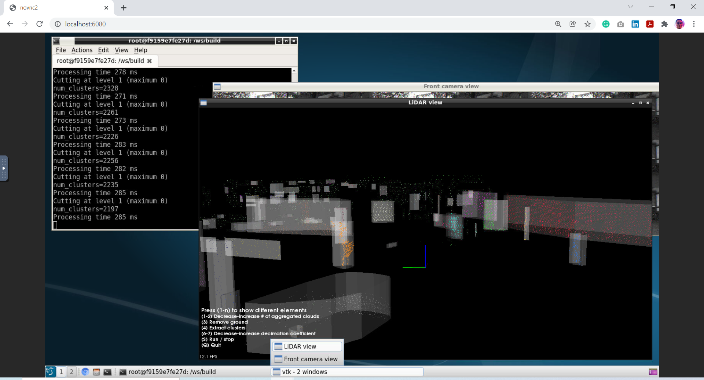

# Instructions to configure hardware and software for the LiDAR Perception course
By Dmitrii Khizbullin

## 1. Obtain a machine

### (A) Local machine
Ubuntu Desktop version 18.04+ and Windows 10 host OS are supported. NVidia or AMD GPU with OpenGL support is highly recommended. The prebuilt Dockerhub image requires a CPU with AVX2 support.

### (B) Create an AWS EC2 instance

Select "Ubuntu Server 18.04 LTS (HVM), SSD Volume Type" image. Choose "g4dn.2xlarge" machine. Increase system disk size to 300 GB. Expose TCP port 6080 in the security group.
| Instance type| RAM | CPUs | storage | GPU | cost |
|---|---|---|---|---|---|
| g4dn.2xlarge | 8 CPU | 32 GiB | NVMe SSD | NVIDIA T4 16GB GPU | $0.838 per Hour |

## 2. Download and unpack Kitti tracking data

### (A) Preview dataset
Download Tracking Mini dataset containing sequences 0 and 3 of Kitti Tracking (600MB download, 1.5BG free space on disk required):

[Download tracking mini dataset](https://drive.google.com/file/d/193DKNlfNX3h3A2u4E1Jg-Y40Xv13MpsD/view?usp=sharing)

### (B) Full dataset
Download the full Kitti tracking dataset (53GB download, 106 GB free space required):
```
cd /home/ubuntu
mkdir git
cd git
git clone https://github.com/Obs01ete/lidar_course.git
```
```
cd /home/ubuntu
mkdir kitti
cd kitti
# optionally run a TMUX session.
bash /home/ubuntu/git/lidar_course/setup/download_data.sh
```
Download may take 40 minutes. Meanwhile the docker image can be built.

Unpack downloaded zip archives:
```
unzip 'data_tracking_*.zip' -d tracking/
```

## 3. Create docker image

### Install docker if not installed
1. For Ubuntu
https://www.digitalocean.com/community/tutorials/how-to-install-and-use-docker-on-ubuntu-18-04
2. For Windows 10
https://docs.microsoft.com/en-us/virtualization/windowscontainers/quick-start/quick-start-windows-10-linux

### (A) Download the image from Dockerhub

Pre-built container (1.3GB), checked for Ubuntu and Windows:
```
docker pull dmitriikhizbullin/lidar_course:latest
```

### (B) Build the image from scratch (Ubuntu only)

```
docker build --tag dmitriikhizbullin/lidar_course:local /home/ubuntu/git/lidar_course/setup
```
The process may take up to 30 minutes to build and takes up to 32 GB RAM. If the build fails due to out-of-memory while compiling PCL, reduce `-j8` to `-j4` in Dockerfile.

Once done, launch the container. Below are instructions for a Dockerhub container.
1. Ubuntu:
```
docker run -p 6080:80 -v /dev/shm:/dev/shm -v /home/ubuntu/git:/ws -v /home/ubuntu/kitti/:/kitti -e RESOLUTION=1600x900 dmitriikhizbullin/lidar_course:latest
```
Windows, in Power Shell:
```
docker run -p 6080:80 -v ${PWD}/git:/ws -v ${PWD}/kitti/:/kitti -e RESOLUTION=1600x900 dmitriikhizbullin/lidar_course:latest
```
Open noVNC session in the browser `http://<your_aws_machine_url>:6080`. Examples:
1. http://localhost:6080/
2. http://ec2-18-222-312-123.us-east-2.compute.amazonaws.com:6080/

## 4. Build and run the code for point cloud processing

In noVNC in the browser:
```
cd /ws/lidar_course/
mkdir build
cd build
cmake ..
make -j8
```

Run the application:
```
./process-sequence /kitti/tracking/training/ 0000
```

You should see an Ubuntu Desktop GUI window in noVNC browser tab. There should be an animated colored point cloud with buildings, trees, cars, cyclists and pedestrians.


